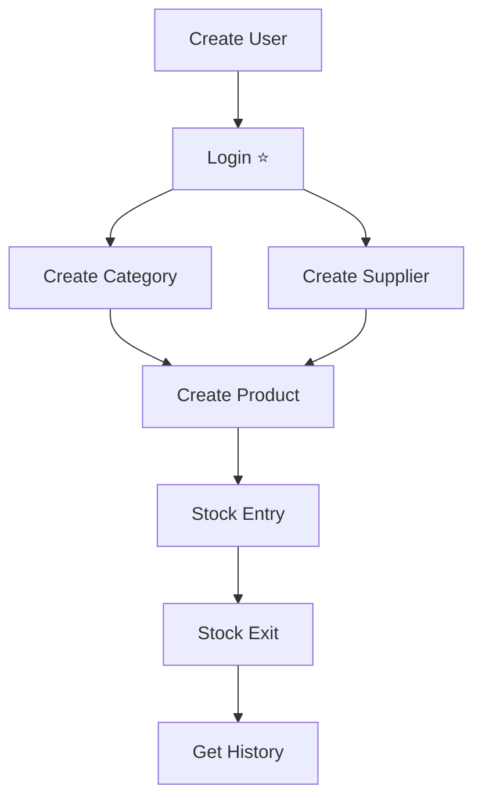

# ⚡ Inicio Rápido - Postman en 5 Minutos

## 🎯 Paso 1: Importar (30 segundos)

```
1. Abre Postman
2. Click "Import"
3. Arrastra: Inventory-API.postman_collection.json
4. ¡Listo!
```

---

## 🚀 Paso 2: Flujo Completo (4 minutos)

### ⚠️ IMPORTANTE: Ejecuta EN ESTE ORDEN

| # | Endpoint | Carpeta | Resultado |
|---|----------|---------|-----------|
| 1️⃣ | **Create User** | Users | Crea admin |
| 2️⃣ | **Login** ⭐ | Authentication | Guarda token automáticamente |
| 3️⃣ | **Create Category** | Categories | Guarda category_id |
| 4️⃣ | **Create Supplier** | Suppliers | Guarda supplier_id |
| 5️⃣ | **Create Product** | Products | Guarda product_id |
| 6️⃣ | **Stock Entry** | Inventory | Añade 100 unidades |
| 7️⃣ | **Get Current Stock** | Inventory | Verifica: 100 unidades |
| 8️⃣ | **Stock Exit (Sale)** | Inventory | Vende 5 unidades |
| 9️⃣ | **Get Current Stock** | Inventory | Verifica: 95 unidades |

---

## ✨ Características Mágicas

### 🔐 Autenticación Automática
```
✅ Haces Login → Token se guarda solo
✅ Todos los requests usan el token automáticamente
✅ No copias/pegas nada
```

### 💾 IDs Automáticos
```
✅ Create Category → Guarda category_id
✅ Create Supplier → Guarda supplier_id
✅ Create Product → Guarda product_id
✅ Los usa en requests siguientes
```

---

## 🎨 Estructura Visual

```
📦 Inventory Management System API
 ┣ 🔐 Authentication (2 endpoints)
 ┣ 👥 Users (6 endpoints)
 ┣ 📁 Categories (5 endpoints)
 ┣ 🏢 Suppliers (5 endpoints)
 ┣ 📦 Products (7 endpoints)
 ┣ 📊 Inventory (7 endpoints) ⭐ CORE
 ┗ 🧪 Tests & Validation (3 endpoints)
```

---

## 📋 Orden de Ejecución Recomendado



---

## 🔧 Variables Pre-configuradas

| Variable | Valor Inicial | Auto-actualiza |
|----------|---------------|----------------|
| base_url | localhost:3000/api | ❌ |
| access_token | (vacío) | ✅ En Login |
| user_id | (vacío) | ✅ En Login |
| category_id | 1 | ✅ En Create |
| supplier_id | 1 | ✅ En Create |
| product_id | 1 | ✅ En Create |

---

## 🧪 Tests Incluidos (Deben Fallar)

```bash
# 1. Test Overselling
❌ Intentar vender 999,999 unidades
✅ Debe retornar: "Insufficient stock"

# 2. Test Sin Evidencia
❌ Ajuste >10% sin foto
✅ Debe retornar: "require photographic evidence"

# 3. Test SKU Duplicado
❌ Crear producto con mismo SKU
✅ Debe retornar: "already exists"
```

---

## 🐛 Solución Rápida de Problemas

| Error | Solución |
|-------|----------|
| ❌ 401 Unauthorized | Ejecuta **Login** de nuevo |
| ❌ Cannot connect | `npm run start:dev` |
| ❌ 404 Not Found | Ejecuta los Create primero |
| ❌ No token | Verifica Variables → access_token |

---

## 💡 Tips Ultra-Rápidos

```bash
# Ver token guardado
Click derecho en colección → Edit → Variables → access_token

# Token expiró?
Ejecuta Login de nuevo (se actualiza solo)

# Cambiar puerto?
Variables → base_url → http://localhost:OTRO_PUERTO/api

# Ver request/response completo?
Console (parte inferior de Postman)

# Ejecutar todo en secuencia?
Click derecho en colección → Run collection
```

---

## 📊 Endpoints Más Usados

```bash
# Top 5 Critical
1. Login                    → Autenticación
2. Create Product           → Agregar productos
3. Stock Entry              → Registrar compras
4. Stock Exit (Sale)        → Registrar ventas
5. Get Movement History     → Ver historial

# Top 5 Consultas
1. Get All Products         → Listar productos
2. Get Current Stock        → Ver stock actual
3. Get All Inventory        → Resumen completo
4. Get Movement History     → Auditoría
5. Get Product by SKU       → Buscar por código
```

---

## 🎯 Casos de Uso Rápidos

### Caso 1: Registrar Compra
```
1. Stock Entry → quantity: 100
2. Get Current Stock → Verifica nuevo stock
```

### Caso 2: Hacer Venta
```
1. Get Current Stock → Verifica disponibilidad
2. Stock Exit (Sale) → quantity: 5
3. Get Current Stock → Verifica stock actualizado
```

### Caso 3: Conteo Físico
```
1. Get Current Stock → Stock en sistema
2. Inventory Adjustment → Stock real contado
3. Get Movement History → Ver el ajuste
```

---

## 📈 Progresión de Aprendizaje

### Nivel 1: Básico (5 min)
- ✅ Import collection
- ✅ Create User + Login
- ✅ Get Profile

### Nivel 2: CRUD (10 min)
- ✅ Create/Read/Update/Delete en cualquier módulo
- ✅ Entender variables automáticas

### Nivel 3: Inventario (15 min)
- ✅ Stock Entry/Exit
- ✅ Adjustments
- ✅ Movement history

### Nivel 4: Avanzado (20 min)
- ✅ Tests de validación
- ✅ Búsquedas avanzadas
- ✅ Filtros y paginación

---

## ⚡ Comandos Paralelos (Swagger)

```bash
# Puedes usar Postman Y Swagger simultáneamente
Postman:  Testing y automatización
Swagger:  http://localhost:3000/api/docs (Exploración)
```

---

## 🎓 Recursos

| Documento | Para Qué |
|-----------|----------|
| **POSTMAN_SETUP.md** | Guía completa |
| **GUIA_PRUEBAS_API.md** | Ejemplos con curl |
| **DOCKER_SETUP.md** | Base de datos |
| **ESTADO_PROYECTO.md** | Overview del sistema |

---

## ✅ Checklist Final

```bash
✅ Colección importada en Postman
✅ Servidor corriendo (npm run start:dev)
✅ Docker PostgreSQL activo (docker ps)
✅ Ejecutado: Create User
✅ Ejecutado: Login (token visible en Variables)
✅ Probado: Get Profile (200 OK)
```

---

## 🎉 ¡Listo!

**Todo funcionando si ves:**
- ✅ Login retorna 200 con token
- ✅ Get Profile retorna tus datos
- ✅ Create Product retorna 201
- ✅ Stock Entry retorna 201

---

**Tiempo total: ~5 minutos**
**Endpoints probados: 31**
**Automatización: 100%**

🚀 **¡A desarrollar!**
